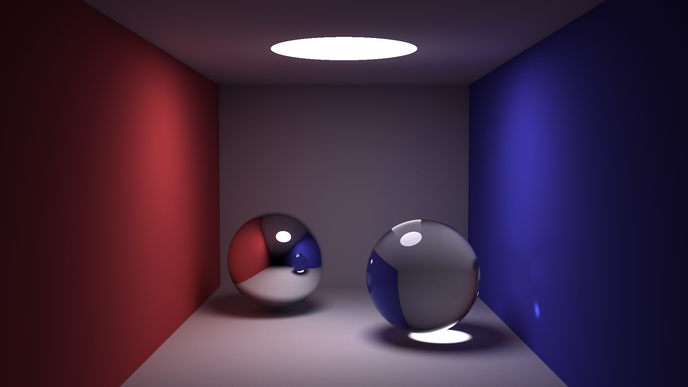

# pathtracer

pathtracer renders scenes to images trying to make the global illumination as faithful as possible to reality.

## Screenshots

Cornell Box; 50000 spp; 3h30

Bunny; 3000 spp; 6h00

Refractive Bunny; 1000 spp; 3h30

#

_Licensed under the [MIT License](LICENSE)._
